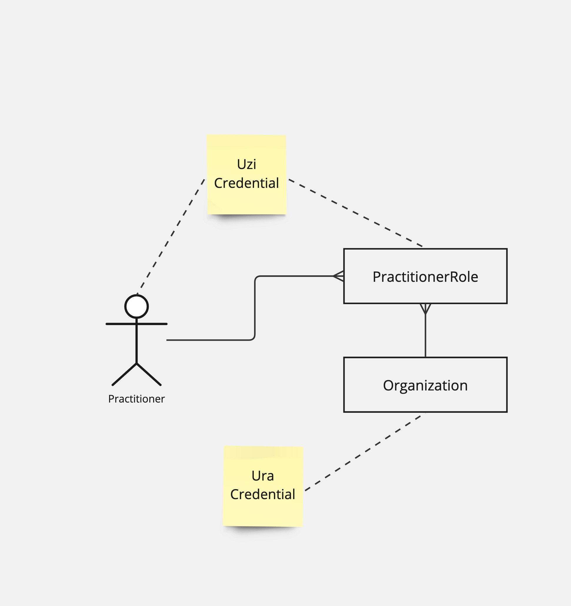
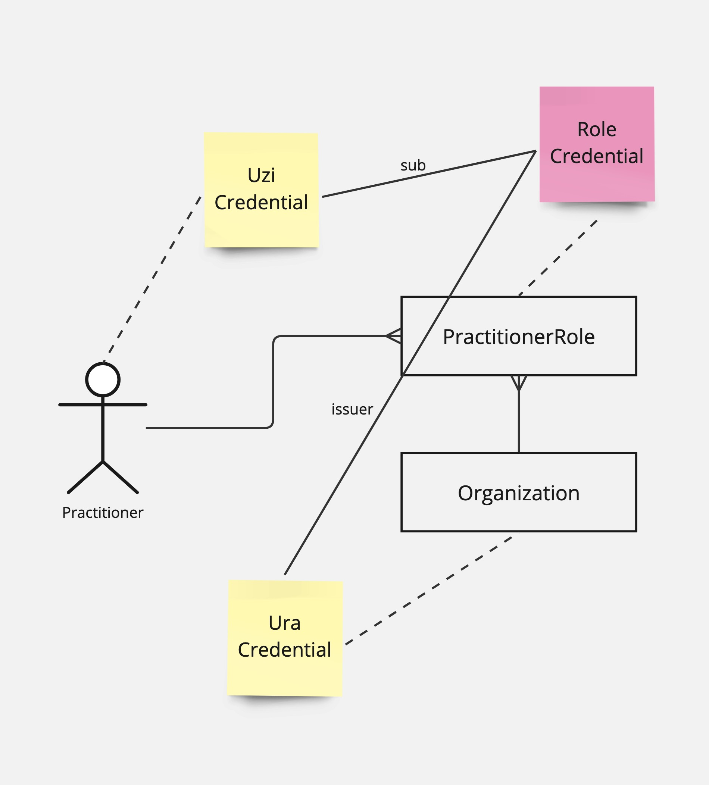
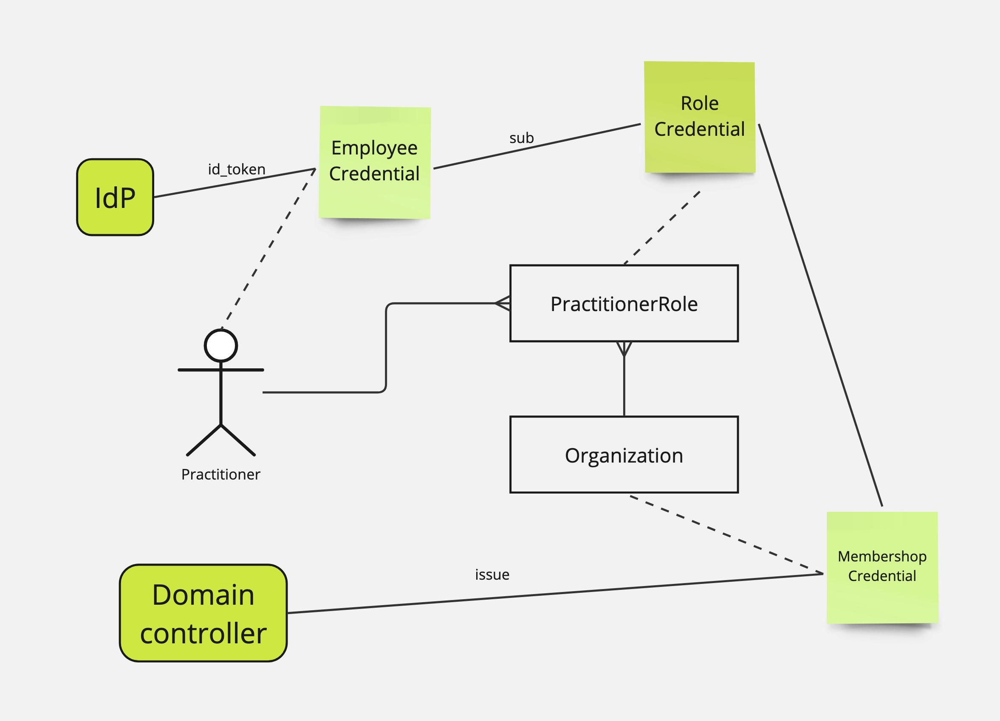

# Authentication
Shared Care Planning (SCP) provides a way of distributed and planning of complex use cases in digital information exchange within healthcare. The cornerstone of all exchange is the authenticity of the actors that exchange information. In order to achieve the right level of authenticity the SCP relies on *Trust over IP*.

## Trust over IP
The Trust over IP framework makes use of Trusted Sources or Trusted Third Parties that are trusted to issuer authentic properties to the participants. These parties are called *issuers* within the Trust over IP framework. Within the Trust over IP framework the participants are able to store the assigned authentic properties within a wallet-like solution. The role of these participants is the role of the credential *holder*.  The credentials used in the Trust over IP framework can be presented by the *holder*. In the case of presentation, the holder is able to proof the ownership as part of the *presentation*. The role of *verifier* is to verify both the issuer of the credential and the holder of the credential. By doing this the verifier can be achieve the right level of authenticity required for the exchange of information required by SCP.

## NUTS and Verifiable Credentials.
The implementation for Trust over IP by SCP is NUTS. The NUTS nodes are able to implement the role of both holder and verifier within the trust construct of SCP. Each role in the SCP has its own NUTS-node that acts both wallet and interface for trust exchange. 

## Sources of trust.
The implementation of Trust over IP requires trusted sources that provide assertions about both individual caregivers and organizations involved in healthcare. At the time of writing this specification, there are no official trusted sources available for both individuals and organizations. However, initiatives such as "IAA in de zorg" are trying to resolve this issue.

### Structure
The structure of the credentials that act as sources of trust are:
* The *UZI credential*, that contains:
  * The UZI code
  * One or more relations, that contain the URA number of the institution abd the Role of the professional.
* The *URA credential* of the organization.

Alternatively, the role can be assigned by the organization itself. Thereby the organization becomes s trusted source itself. As the organization holds a URA credential the verifier is albe to verify the authenticity of both the professional (UZI) and organization (URA), and the assigned role issued by the organization.

## Practical implementation
As the sources of trust are not available yet, we need to work with whatever is around right now. The tentative credential structure will be:

* The EmployeeCredential, represents a login of an employee by wrapping the id_token.
* The membership credentials is assigned to an organization by an issuer with the role "domain controller". 
* The Role credential is issued by the organization to the owner of the EmployeeCredential.

