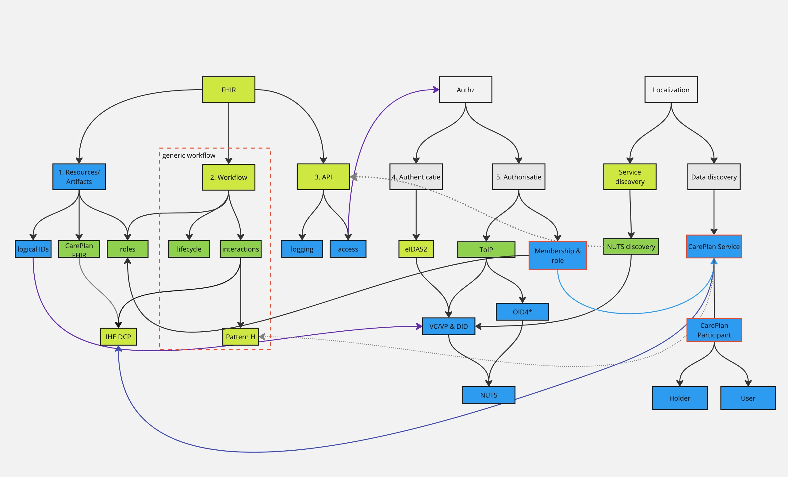

# Overview of the documentation structure

The image below displays the schematic overview of the topics.

Legenda
- Light green, existing standards that don't need a specific description of the usage.
- Dark green, existing standards that need a specific description of the usage.
- Blue, the topics that need description.

